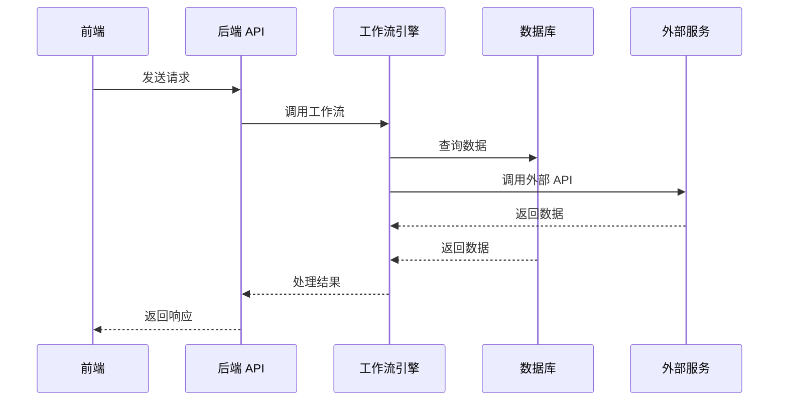

# 途灵 TripMind 智能旅行助手技术文档

## 1. 系统概述

途灵 TripMind 是一个基于 AI 的智能旅行助手系统，旨在为用户提供全方位的旅行规划、预订和管理服务。系统采用前后端分离架构，前端使用 React 构建现代化的用户界面，后端使用 FastAPI 提供高性能的 API 服务。

### 1.1 系统功能

- **用户管理**：注册、登录、个人信息管理
- **旅行规划**：智能行程推荐、目的地探索、行程定制
- **预订服务**：机票、酒店、租车预订
- **预算管理**：旅行预算规划与跟踪
- **行程管理**：行程查看、修改、分享
- **地图服务**：世界地图探索、足迹记录
- **智能助手**：基于大语言模型的旅行顾问

### 1.2 技术栈

| 类别 | 技术 | 版本 | 用途 |
|------|------|------|------|
| 前端 | React | 19.2.4 | 构建用户界面 |
| 前端 | Tailwind CSS | 4.2.2 | 样式管理 |
| 前端 | Vite | 8.0.1 | 构建工具 |
| 后端 | FastAPI | 最新版 | API 服务 |
| 后端 | SQLAlchemy | 最新版 | ORM |
| 后端 | MySQL | 最新版 | 数据库 |
| 后端 | LangChain | 最新版 | 大语言模型集成 |

## 2. 系统架构

### 2.1 架构图



### 2.2 目录结构

```
XieChengAssistant/
├── backend/                 # 后端代码
│   ├── api/                # API 路由
│   │   ├── budget_api/     # 预算管理 API
│   │   ├── graph_api/      # 工作流调用 API
│   │   ├── system_mgt/     # 系统管理 API
│   │   └── routers.py      # 路由配置
│   ├── config/             # 配置文件
│   ├── db/                 # 数据库相关
│   │   └── system_mgt/     # 系统管理数据模型
│   ├── graph_chat/         # 工作流引擎
│   ├── tools/              # 工具函数
│   ├── utils/              # 通用工具
│   ├── app.py              # Streamlit 应用
│   └── main.py             # FastAPI 应用
├── frontend/                # 前端代码
│   ├── public/             # 静态资源
│   ├── src/                # 源代码
│   │   ├── assets/         # 资源文件
│   │   ├── components/     # 组件
│   │   │   ├── views/      # 视图组件
│   │   │   ├── Chat.jsx    # 聊天组件
│   │   │   ├── Login.jsx   # 登录组件
│   │   │   └── Register.jsx # 注册组件
│   │   ├── App.jsx         # 应用主组件
│   │   └── main.jsx        # 应用入口
│   └── package.json        # 前端依赖
└── README.md               # 项目说明
```

## 3. 前端功能模块

### 3.1 登录与注册

- **登录页面**：支持邮箱和密码登录，带有记住我功能
- **注册页面**：支持邮箱、密码注册，自动生成乘客 ID
- **密码加密**：前端密码加密传输，后端存储哈希值

### 3.2 主界面

- **侧边栏**：导航菜单、历史对话、用户信息
- **顶部导航**：应用标题、功能导航、通知、个人中心
- **欢迎页面**：Bento 卡片布局，推荐热门行程
- **聊天界面**：消息列表、输入框、语音输入

### 3.3 功能视图

#### 3.3.1 推荐视图 (RecommendView)

- **智能推荐**：基于季节和用户偏好推荐目的地
- **标签筛选**：按地区、类型等筛选目的地
- **行程规划**：一键生成目的地行程

#### 3.3.2 目的地视图 (DestinationsView)

- **目的地列表**：展示热门目的地
- **收藏功能**：收藏喜欢的目的地
- **详情查看**：查看目的地详细信息

#### 3.3.3 行程规划视图 (ItineraryView)

- **行程模板**：提供预设行程模板
- **自定义规划**：根据用户需求定制行程
- **行程预览**：可视化行程安排

#### 3.3.4 世界地图视图 (WorldMapView)

- **交互式地图**：展示世界热门目的地
- **标记功能**：标记已访问和计划访问的地点
- **地图探索**：探索不同地区的旅行信息

#### 3.3.5 足迹视图 (FootprintView)

- **旅行记录**：记录用户的旅行历史
- **统计分析**：分析旅行数据和偏好
- **回忆分享**：分享旅行经历

#### 3.3.6 预算管理视图 (BudgetView)

- **预算设置**：设置旅行预算
- **支出跟踪**：跟踪旅行支出
- **预算分析**：分析预算使用情况

#### 3.3.7 统计视图 (StatsView)

- **旅行数据**：统计旅行次数、天数、花费等
- **偏好分析**：分析旅行偏好和习惯
- **趋势预测**：预测未来旅行趋势

#### 3.3.8 礼宾服务视图 (ConciergeView)

- **特殊请求**：提交特殊旅行请求
- **个性化服务**：提供个性化旅行建议
- **紧急支持**：提供旅行紧急支持

### 3.4 聊天功能

- **智能对话**：与 AI 助手进行自然语言对话
- **流式响应**：实时显示 AI 回复
- **工作流集成**：调用后端工作流处理复杂请求
- **审批流程**：重要操作需要用户批准

### 3.5 通知系统

- **订单通知**：订单状态更新通知
- **行程提醒**：行程时间提醒
- **系统通知**：系统重要通知

## 4. 后端功能模块

### 4.1 用户管理

- **用户注册**：创建新用户，生成乘客 ID
- **用户登录**：验证用户身份，生成 JWT token
- **用户信息**：获取和更新用户信息

### 4.2 工作流引擎

- **图结构**：基于 LangChain 的状态图工作流
- **工具调用**：调用各种旅行相关工具
- **状态管理**：管理工作流状态和上下文

### 4.3 API 接口

#### 4.3.1 用户 API

- `POST /api/register/`：用户注册
- `POST /api/login/`：用户登录
- `GET /api/users/getUsers/`：获取用户列表
- `GET /api/users/{pk}/`：获取单个用户信息
- `PATCH /api/users/{pk}/`：更新用户信息
- `POST /api/users/delete/`：删除用户

#### 4.3.2 工作流 API

- `POST /api/graph/`：调用工作流
- `POST /api/graph/stream/`：流式调用工作流
- `POST /api/chat/save/`：保存对话历史
- `GET /api/chat/history/`：获取对话历史列表
- `GET /api/chat/history/{thread_id}/`：获取对话详情

#### 4.3.3 其他 API

- `GET /api/weather/`：查询城市天气
- `GET /api/user/bookings/`：获取用户订单
- `GET /api/budget/`：获取预算信息

### 4.4 工具集成

- **航班工具**：查询和预订航班
- **酒店工具**：查询和预订酒店
- **租车工具**：查询和预订租车
- **旅行工具**：旅行相关工具和信息
- **搜索工具**：搜索旅行相关信息

## 5. 技术实现细节

### 5.1 前端实现

#### 5.1.1 组件架构

- **功能组件**：可复用的 UI 组件
- **视图组件**：完整的页面视图
- **状态管理**：使用 React useState 和 useCallback 管理状态
- **API 调用**：使用 fetch API 调用后端接口

#### 5.1.2 样式实现

- **Tailwind CSS**：使用 Tailwind CSS 进行样式管理
- **自定义样式**：使用内联样式实现复杂效果
- **响应式设计**：适配不同屏幕尺寸
- **动画效果**：使用 CSS 动画增强用户体验

#### 5.1.3 性能优化

- **代码分割**：使用 React.lazy 和 Suspense 实现代码分割
- **缓存策略**：缓存 API 响应和计算结果
- **状态管理优化**：使用 useCallback 和 useMemo 优化性能
- **渲染优化**：避免不必要的重新渲染

### 5.2 后端实现

#### 5.2.1 API 设计

- **RESTful API**：遵循 REST 设计原则
- **FastAPI**：使用 FastAPI 框架构建 API
- **异步处理**：使用 async/await 处理异步请求
- **数据验证**：使用 Pydantic 进行数据验证

#### 5.2.2 工作流实现

- **LangChain**：使用 LangChain 构建工作流
- **状态图**：使用 StateGraph 管理工作流状态
- **工具集成**：集成各种旅行相关工具
- **检查点**：使用 MySQL 存储工作流检查点

#### 5.2.3 数据库设计

- **MySQL**：使用 MySQL 作为数据库
- **SQLAlchemy**：使用 SQLAlchemy 作为 ORM
- **表结构**：用户表、订单表、对话历史表等
- **索引优化**：为常用查询创建索引

### 5.3 安全实现

- **JWT 认证**：使用 JWT 进行身份认证
- **密码加密**：使用 bcrypt 加密存储密码
- **HTTPS**：使用 HTTPS 保护传输数据
- **输入验证**：验证所有用户输入
- **权限控制**：基于角色的权限控制

## 6. 部署指南

### 6.1 环境要求

- **前端**：Node.js 18+，npm 9+
- **后端**：Python 3.8+，pip 20+
- **数据库**：MySQL 8.0+
- **服务器**：支持 WSGI/ASGI 的服务器

### 6.2 前端部署

1. **安装依赖**：
   ```bash
   cd frontend
   npm install
   ```

2. **构建项目**：
   ```bash
   npm run build
   ```

3. **部署静态文件**：
   - 将 `dist` 目录部署到静态文件服务器
   - 配置 Nginx 或 Apache 作为反向代理

### 6.3 后端部署

1. **安装依赖**：
   ```bash
   cd backend
   pip install -r requirements.txt
   ```

2. **配置数据库**：
   - 创建 MySQL 数据库
   - 执行 SQL 脚本创建表结构
   - 配置 `.env` 文件

3. **启动服务**：
   ```bash
   uvicorn main:app --host 0.0.0.0 --port 8000
   ```

4. **配置反向代理**：
   - 使用 Nginx 配置反向代理
   - 配置 SSL 证书

### 6.4 系统配置

- **环境变量**：配置必要的环境变量
- **日志配置**：配置日志级别和路径
- **缓存配置**：配置缓存策略
- **安全配置**：配置 CORS、CSRF 等安全设置

## 7. 系统监控与维护

### 7.1 监控

- **日志监控**：监控系统日志
- **性能监控**：监控系统性能指标
- **错误监控**：监控系统错误
- **API 监控**：监控 API 调用情况

### 7.2 维护

- **数据库备份**：定期备份数据库
- **系统更新**：定期更新系统组件
- **安全补丁**：及时应用安全补丁
- **性能优化**：定期优化系统性能

## 8. 总结

途灵 TripMind 是一个功能完整、技术先进的智能旅行助手系统，它结合了现代前端技术和后端工作流引擎，为用户提供了全方位的旅行服务。系统采用前后端分离架构，具有良好的可扩展性和可维护性。

通过集成大语言模型和各种旅行工具，系统能够为用户提供个性化的旅行建议和服务。同时，系统还提供了丰富的可视化界面，使用户能够直观地规划和管理自己的旅行。

未来，系统可以进一步扩展，增加更多的旅行服务和功能，如旅行保险、签证服务、当地向导等，为用户提供更加全面的旅行体验。